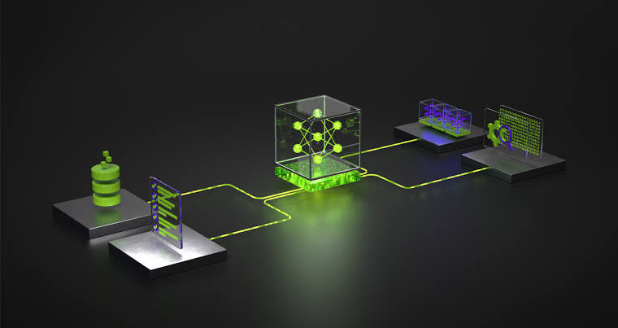
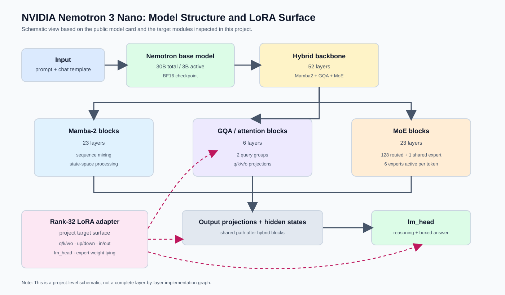
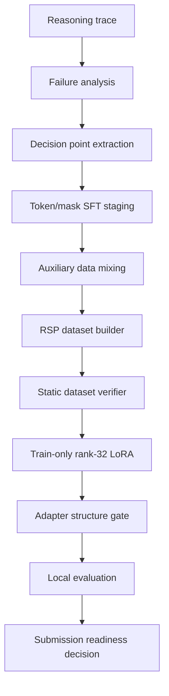

  

# NVIDIA Nemotron Reasoning

### From reasoning failures to rule-selection training

NVIDIA Nemotron Model Reasoning Challenge를 계기로 진행한 reasoning adapter 학습·분석 프로젝트입니다.

긴 reasoning text를 단순히 더 학습하는 대신, 모델이 어느 rule branch에서 실패하는지 분석하고 이를 rule-selection training 문제로 재정의했습니다. 이 저장소는 LoRA 학습 코드, 데이터 설계, 실험 기록, 평가·제출 검증 도구를 공개용으로 정리합니다.

| 구분 | 내용 |
| --- | --- |
| What I built | Nemotron LoRA adapter training pipeline과 데이터·평가·제출 검증 흐름 |
| Current evidence | Kaggle full recipe, token/mask staging, replay mixing, domain-weighted loss, adapter 구조 분석 |
| Historical placement | 275 / 4,183 (상위 약 6.6%), 기록된 competition placement |
| Not claimed | 최종 adapter 성능 재현, 최종 adapter 공개, 모든 실험의 독립적인 성능 검증 |

## Project Summary

대회는 NVIDIA-Nemotron-3-Nano-30B-A3B-BF16 base model에 적용할 rank-32 이하 LoRA adapter를 제출하고, hidden reasoning puzzle의 최종 답을 평가하는 방식입니다.

기록된 competition placement는 **275 / 4,183 (상위 약 6.6%)**입니다. 이 수치는 당시 제출 기록을 설명하기 위한 historical placement이며, 현재 공개 저장소에서 최종 adapter나 leaderboard 결과를 재현했다는 주장은 아닙니다.

| Domain | Task |
| --- | --- |
| Bit manipulation | 8-bit input/output 예시에서 transformation rule 추론 |
| Gravity | 예시에서 hidden gravitational constant 추론 |
| Unit conversion | 가상 단위 간 conversion rule 복원 |
| Text encryption | 문장 쌍에서 substitution rule 복원 |
| Numeral conversion | 가상 numeral system 변환 규칙 추론 |
| Equation transformation | 수식·문자열 변환 규칙 추론 |

최종 출력은 boxed answer 형식으로 추출되며, binary/string 답은 엄격 비교하고 숫자 답은 tolerance 기반으로 평가합니다.

## Key Implementation

- domain별 reasoning failure와 오답 패턴 분석
- prompt와 assistant completion을 분리한 token/mask SFT
- replay_math 및 24개 subtraction sub-replay interleaving
- equation_numeric·bit_manipulation target-token loss weighting
- bit/equation failure를 decision point와 candidate rule branch로 분해
- anchor_sft, decision_sft, decision_preferences RSP schema 구성
- rank-32 LoRA adapter merge와 SVD compression 경로 구현
- 동일 evaluation sample 기반 multi-adapter 비교
- dataset, training, evaluation, submission static safety gate 구현

## Problem Framing

이 프로젝트에서 reasoning failure는 단순한 답 문자열 생성 실패로만 보지 않았습니다.

    Reasoning trace
        -> Decision point
        -> Candidate rules
        -> Correct branch selection
        -> Stable boxed answer

주요 failure pattern은 다음과 같습니다.

- bit manipulation에서 output bit별 rule 선택 오류
- equation transformation에서 branch rule과 position-specific mapping 혼동
- reasoning 형식은 자연스럽지만 마지막 boxed answer가 틀리는 경우
- adapter namespace와 target module 차이에서 발생하는 training-serving mismatch
- weak domain을 보강할 때 기존 domain 성능이 손상되는 현상

## System Architecture

이 그림은 NVIDIA Nemotron 3 Nano의 hybrid Mamba/MoE backbone과 이 프로젝트에서 확인한 rank-32 LoRA target surface를 함께 보여주는 모델 구조 시각화 자료입니다. 전체 layer 구현을 그대로 재현한 graph가 아니라, 모델 카드의 구조 정보와 실제 학습 코드의 adapter 적용 지점을 연결한 프로젝트 수준의 설명도입니다.

Nemotron 모델 구조 시각화 자료와 adapter target 설명은 [Nemotron Model Structure Visualization](docs/architecture.md#nemotron-model-structure-visualization)에서 확인할 수 있습니다.

## Data Design

학습 데이터는 일반 text JSONL이 아니라 token/mask 기반 corpus를 중심으로 구성했습니다.

핵심 source corpus는 [Tong Huikang의 공개 Nemotron repository](https://github.com/tonghuikang/nemotron)에 기록된 데이터 생성 pipeline에서 만들어진 corpus를 기반으로 사용했습니다. 이 저장소는 해당 원본 데이터의 제작자라고 주장하지 않으며, 원본 corpus의 구조를 분석한 뒤 replay·auxiliary mixing·domain weighting·RSP 재구성을 진행했습니다. 구성 규칙과 provenance는 [Dataset](docs/dataset.md)에 정리했습니다.

    tokens = prompt tokens + assistant reasoning + final answer
    mask   = 0              + 1                  + 1

학습 시에는 다음과 같이 next-token objective에 사용합니다.

    input_ids = tokens[:-1]
    targets   = tokens[1:]
    weights   = mask[1:]

원본 token/mask corpus는 tokens/<problem_id>/synthetic.json과 logprobs/index.jsonl 구조로 읽었습니다. epoch 0 training order를 replay하고, 최대 sequence length를 8,192로 제한했습니다.

보조 데이터는 원본 stream을 대체하지 않고 같은 token/mask 형식으로 변환한 뒤 일정 간격으로 섞었습니다.

| Data stream | Purpose |
| --- | --- |
| Original token/mask corpus | 기존 reasoning behavior replay |
| replay_math | math reasoning coverage 보강 |
| Subtraction sub-replay | 특정 rule family 보강 |
| Equation branch-map rows | symbolic branch failure 보강 |
| Preference pairs | correct branch와 plausible wrong branch 비교 |

가장 구체적인 변환·mixing recipe는 [Recipe Evidence](experiments/recipe-evidence.md)에 정리했습니다.

## Training Recipe

확인된 full recipe의 중심 설정은 다음과 같습니다.

| 항목 | 설정 |
| --- | --- |
| Base model | [NVIDIA Nemotron 3 Nano 30B A3B BF16](https://huggingface.co/nvidia/NVIDIA-Nemotron-3-Nano-30B-A3B-BF16) |
| LoRA | r=32, alpha=32, dropout=0.0 |
| Target | attention/projection/MLP module 및 lm_head |
| Sequence length | 8,192 |
| Batch | batch 32, micro-batch 4 |
| Precision | base BF16, LoRA parameter FP32 |
| Optimization | AdamW, gradient checkpointing, linear LR decay |
| Memory | Cut Cross Entropy, micro-batch accumulation |
| MoE handling | expert LoRA weight tying, 필요 시 lm_head 수동 보완 |

## NVIDIA Technology

- [NVIDIA Nemotron 3 Nano 30B A3B BF16](https://huggingface.co/nvidia/NVIDIA-Nemotron-3-Nano-30B-A3B-BF16) base model
- Nemotron-H의 Mamba/MoE 구조와 expert parameter target 분석
- NVIDIA GPU 환경에서 BF16 training 및 CUDA kernel 검증
- mamba_ssm, causal_conv1d runtime dependency
- Unsloth와 PEFT 기반 LoRA injection
- Transformers, TRL, bitsandbytes, Cut Cross Entropy
- vLLM-style LoRA loading과 boxed-answer evaluation workflow

## Experiments

| Experiment | Focus |
| --- | --- |
| Token/mask replay SFT | 기존 corpus의 order와 loss mask replay |
| CoT-selected SFT | checker를 통과한 reasoning trace 선별 |
| Auxiliary data mixing | math 및 rule-specific 보조 데이터 interleaving |
| Domain weighting | weak domain target-token loss 조정 |
| Adapter merge/SVD | 여러 adapter signal을 rank 32로 압축·변환 |
| STaR-style self-correction | 정답 trace filtering과 repair branch 설계 검토 |
| RSP | reasoning failure를 rule-selection 학습으로 재정의 |

각 실험은 [experiments/](experiments/)에, 기술별 구현은 [techniques/](techniques/)에 정리했습니다.

## Best Observed Adapter

내 실험 기록에서 가장 강한 기준점으로 사용한 것은 A086 계열 rank-32 LoRA adapter입니다. 공개 저장소에는 checkpoint나 submission artifact를 포함하지 않고, 구조와 후속 실험의 기준점만 기록합니다.

구조와 recipe는 [Best Observed Adapter](docs/best-observed-adapter.md)와 [Highest Observed Run](experiments/highest-observed-run.md)에서 확인할 수 있습니다. Kaggle에 남은 가장 구체적인 학습 recipe는 [full-recipe notebook](https://www.kaggle.com/code/leegongman/huikang-develop?scriptVersionId=322894360)을 참고할 수 있습니다.

## Evaluation and Submission

평가·제출 단계는 학습 단계와 분리했습니다.

- scripts/eval/auto_evaluator.py: boxed answer extraction 및 local evaluation
- scripts/eval/run_eval.sh: evaluation 실행 wrapper
- scripts/package/verify_rsp_train_shell.py: train script와 adapter 구조 검증
- scripts/data/verify_rsp_dataset.py: schema, count, domain, answer 검증

최종 adapter는 adapter_config.json과 adapter_model.safetensors 구조를 만족해야 하며, rank·target module·namespace가 runtime 조건과 맞아야 합니다.

## My Contributions

- scripts/data/build_rsp_dataset.py: RSP dataset builder
- scripts/data/verify_rsp_dataset.py: dataset static verifier
- scripts/train/rsp_train_tokenmask_compatible.py: token/mask SFT 및 preference training entrypoint
- scripts/package/verify_rsp_train_shell.py: training·adapter safety gate
- scripts/package/build_rsp_train_kernel.py: 실행용 training kernel builder
- docs/dataset.md: 데이터 구조와 변환 규칙
- experiments/recipe-evidence.md: 실제 Kaggle recipe와 hyperparameter
- experiments/: 데이터 mixing, domain weighting, merge/SVD, STaR, RSP 실험 기록

## Repository Structure

    .
    ├── README.md
    ├── assets/        # repository visuals
    ├── docs/          # architecture, dataset, training, experiments
    ├── experiments/   # experiment records and recipe evidence
    ├── techniques/    # PEFT, masking, optimization, merge/SVD
    ├── data/          # dataset documentation
    ├── schemas/       # RSP schema and design contracts
    ├── scripts/
    │   ├── data/
    │   ├── train/
    │   ├── eval/
    │   └── package/
    ├── configs/       # small reproducible recipe examples
    ├── examples/      # small schema preview
    └── team/          # separately attributed team artifacts

## How to Run

Install dependencies:

    python -m pip install -r requirements.txt

Stage the full/private input files and build the RSP dataset:

    python scripts/data/build_rsp_dataset.py \
      --anchor /path/to/anchor.jsonl \
      --equation /path/to/equation.jsonl \
      --target-repair /path/to/target_repair_rows.jsonl \
      --output-dir data/rsp_dataset

Run static verification:

    python scripts/data/verify_rsp_dataset.py \
      --dataset-dir data/rsp_dataset \
      --json-output data/rsp_dataset/rsp_verification.json

    python scripts/package/verify_rsp_train_shell.py \
      --train-script scripts/train/rsp_train_tokenmask_compatible.py \
      --dataset-verification data/rsp_dataset/rsp_verification.json

Run a trainer dry-run:

    python scripts/train/rsp_train_tokenmask_compatible.py \
      --dataset-dir data/rsp_dataset \
      --model /path/to/NVIDIA-Nemotron-3-Nano-30B-A3B-BF16 \
      --dry-run

examples/rsp_dataset_sample/는 schema preview이므로 full row-count gate를 통과하는 학습 데이터셋이 아닙니다. 전체 학습에는 Nemotron model, CUDA/PyTorch runtime, 호환 GPU, full dataset artifact가 필요합니다.

## Current Status

현재 저장소는 최종 adapter 배포물이 아니라, 실험과 학습 pipeline을 공개용으로 정리한 repository입니다.

- Documentation: ready
- Core scripts: included
- Small schema examples: included
- Full dataset: excluded
- Checkpoints and submission archive: excluded
- Final verified score: not claimed

자세한 재현 조건과 제한사항은 [docs/reproducibility.md](docs/reproducibility.md)와 [docs/project-status.md](docs/project-status.md)를 참고하세요.
