# Nemotron Reasoning Adapter Pipeline

[NVIDIA Nemotron Model Reasoning Challenge](https://www.kaggle.com/competitions/nvidia-nemotron-model-reasoning-challenge)를 기반으로, Nemotron rank-32 LoRA adapter 학습을 위한 **token/mask SFT 데이터 구성, 보조 데이터 mixing, adapter 변환, RSP rule-selection 학습 pipeline**을 정리한 포트폴리오 프로젝트입니다.

이 저장소의 핵심은 최종 점수 자랑이 아니라, reasoning failure를 분석해서 **규칙 선택 학습 문제**로 재정의하고, 데이터 staging, adapter training, evaluation gate, submission safety를 재현 가능한 형태로 정리한 것입니다.

| 구분 | 내용 |
| --- | --- |
| What I built | token/mask SFT corpus 구성, auxiliary data mixing, SVD adapter conversion analysis, RSP rule-selection training package |
| Current evidence | Kaggle notebook evidence, teammate experiment artifacts, static dataset verification, adapter structure checks, train-ready scripts |
| Not claimed | 최종 verified leaderboard score, 최종 공개 adapter/checkpoint, 외부 원천 corpus 자체를 내가 제작했다는 주장 |

## Overview

이 프로젝트는 `nvidia/NVIDIA-Nemotron-3-Nano-30B-A3B-BF16` 모델에 적용할 수 있는 LoRA adapter 학습 워크플로우를 다룹니다. 핵심 작업은 대회 puzzle을 그대로 text SFT로 넣는 것이 아니라, prompt와 assistant completion을 분리한 token/mask corpus로 구성하고, weak domain 보강용 auxiliary rows와 preference pairs를 추가해 train-ready package로 만든 것입니다.

현재 공개 repo는 전체 원본 데이터나 checkpoint를 포함하지 않습니다. 대신 핵심 스크립트, 작은 example dataset, verifier, training shell, 문서화된 실험 기록만 포함합니다.

## Problem

대회 문제는 단순히 긴 reasoning text를 생성하는 문제가 아닙니다. 모델은 hidden task에서 올바른 규칙을 고르고, 그 규칙을 끝까지 유지한 뒤, 최종 답을 `\boxed{}` 안에 안정적으로 출력해야 합니다.

공식 대회 기준은 다음과 같습니다.

- 공통 baseline은 NVIDIA Nemotron-3-Nano-30B 계열 모델입니다.
- 최종 제출물은 base model 전체가 아니라 rank 32 이하의 LoRA adapter를 담은 `submission.zip`입니다.
- Kaggle evaluator는 vLLM으로 base model과 adapter를 로드하고, temperature 0.0으로 답변을 생성합니다.
- metric은 최종 답을 `\boxed{}`에서 우선 추출하고, 문자열 exact match 또는 수치 relative tolerance `1e-2` 기준으로 accuracy를 계산합니다.
- 공개 `test.csv`는 submission authoring용 작은 sample이고, 실제 scoring 시에는 수백 개 hidden problems로 교체됩니다.

주요 실패 패턴은 다음과 같았습니다.

- bit manipulation에서 output bit별 rule을 잘못 선택
- equation/symbolic transformation에서 branch rule과 position-specific mapping을 잘못 선택
- reasoning 형식은 그럴듯하지만 마지막 boxed answer가 틀림
- adapter 변환 과정에서 training-serving mismatch 발생
- broad SFT가 일부 weak domain을 개선해도 protected/easy domain을 망가뜨릴 위험 존재

## Key Idea

핵심 아이디어는 reasoning failure를 “정답 문자열 생성 실패”가 아니라 **규칙 선택 실패**로 보는 것입니다.

- deterministic trace를 completion-only SFT corpus로 구성
- prompt token은 loss에서 제외하고 reasoning/completion token만 학습
- bit/equation failure를 decision point로 쪼개고 correct branch와 wrong branch를 구분
- auxiliary data는 원본 corpus를 압도하지 않도록 capped token budget, low weight, interleaving 방식으로 삽입
- final score claim 대신 dataset/training/evaluation gate를 분리

최신 공개 package는 RSP, 즉 Rule Selection Post-Training으로 정리했습니다.

## NVIDIA Technology Usage

| 항목 | 사용 방식 |
| --- | --- |
| NVIDIA Nemotron | `NVIDIA-Nemotron-3-Nano-30B-A3B-BF16` base model을 adapter 학습 대상으로 사용 |
| LoRA adapter | rank 32 / alpha 32 / dropout 0.0 adapter contract를 중심으로 실험 |
| Nemotron-H / MoE structure | `q_proj`, `k_proj`, `v_proj`, `o_proj`, `in_proj`, `out_proj`, `up_proj`, `down_proj`, `lm_head` target modules |
| Kaggle NVIDIA GPU runtime | RTX PRO 6000, T4 feasibility/probe, Kaggle competition environment 기준으로 설계 |
| CUDA/PyTorch runtime | BF16 training, gradient checkpointing, CCE-style memory optimization, external GPU payload |
| vLLM/Transformers-style eval | local evaluation and boxed-answer extraction safety checks |

## System Architecture

```mermaid
flowchart TD
    A["Competition train.csv / token-mask replay corpus"] --> B["Dataset structure analysis"]
    B --> C["Token/mask SFT staging"]
    C --> D["Auxiliary data mixing"]
    D --> E["RSP dataset builder"]
    E --> F["Static dataset verifier"]
    F --> G["Train-only rank-32 LoRA script"]
    G --> H["Adapter artifact"]
    H --> I["Adapter structure gate"]
    I --> J["Local eval protocol"]
    J --> K["Submission readiness decision"]
```



`rsp_train_tokenmask_compatible.py`는 train-only entrypoint입니다. Evaluation과 submission은 별도 evidence gate를 통과해야 합니다.

## Dataset & Training Pipeline

### Competition seed data

대회 `train.csv`는 `id`, `prompt`, `answer`를 포함하는 9,500개 puzzle로 구성되어 있습니다.

| Domain family | Rows | 문제 성격 |
| --- | ---: | --- |
| Bit manipulation | 1,602 | 8-bit binary input/output transformation rule 추론 |
| Gravity | 1,597 | `d = 0.5*g*t^2` 형태에서 hidden gravitational constant 추론 |
| Unit conversion | 1,594 | Wonderland unit conversion rule 추론 |
| Text encryption | 1,576 | 예시 문장 쌍에서 substitution/encryption rule 복원 |
| Numeral conversion | 1,576 | 숫자를 Wonderland numeral system으로 변환 |
| Equation transformation | 1,555 | symbolic equation/string transformation rule 추론 |

### Token/mask SFT corpus

학습 corpus는 text-only JSONL이 아니라 pre-tokenized completion-only SFT 형태로 구성했습니다.

```text
tokens/<problem_id>/synthetic.json
logprobs/index.jsonl
```

각 row는 다음 구조를 따릅니다.

```json
{
  "tokens": ["prompt tokens + assistant reasoning + final answer"],
  "mask": ["0 for prompt, 1 for assistant completion"]
}
```

Trainer에서는 다음처럼 학습 row를 만듭니다.

```text
input_ids = tokens[:-1]
targets   = tokens[1:]
weights   = mask[1:]
```

이 설계의 목적은 prompt memorization을 줄이고, solver trace와 최종 `\boxed{answer}`를 안정적으로 생성하도록 학습시키는 것입니다.

### 내가 구성/실험한 데이터 흐름

| 데이터/실험 | 구성 방식 | 목적 |
| --- | --- | --- |
| CoT-selected SFT | generated CoT 중 rule-based checker를 통과한 row만 SFT로 사용 | noisy reasoning 제거 |
| token/mask replay SFT | `tokens/<id>/synthetic.json`과 `logprobs/index.jsonl` order를 사용 | deterministic trace 재현 |
| merged balanced SFT | replay corpus에 개인/보조 rows를 합쳐 mixed corpus 구성 | broad behavior와 weak domain 보강 |
| math replay interleaving | 외부 math replay를 chat template으로 tokenization 후 일정 간격 삽입 | general reasoning coverage 추가 |
| E3 branch-map interleaving | symbolic equation branch-map rows를 token/mask로 변환 후 삽입 | equation rule-selection failure 보강 |
| domain weighting | equation/bit domain에 sample/loss weight 부여 | weak domain update 강도 조절 |
| RSP dataset | `anchor_sft`, `decision_sft`, `decision_preferences` 세 family로 재구성 | rule-selection 학습 문제로 재정의 |

데이터 구성은 “원천 문제를 그대로 학습”하는 방식이 아니라 다음 단위로 다시 설계했습니다.

1. 대회 prompt/answer에서 domain과 answer format을 분리해 seed 분석 기준을 만들었습니다.
2. replay 가능한 token/mask row에서는 prompt token을 `mask=0`, assistant reasoning과 final boxed answer를 `mask=1`로 두었습니다.
3. bit/equation 실패를 decision point로 나누고, correct branch trace를 `decision_sft`로 만들었습니다.
4. 실제로 그럴듯하지만 틀린 reasoning을 rejected branch로 두어 `decision_preferences`를 구성했습니다.
5. math replay와 equation branch-map rows는 target stream을 압도하지 않도록 capped/interleaved auxiliary rows로 섞었습니다.
6. weak domain에는 sample/loss weight를 주되, protected domain은 `anchor_sft`로 유지했습니다.

### RSP public package

Clean repo에 포함된 RSP 설계는 세 가지 row family를 사용합니다.

| Row family | Rows | Purpose |
| --- | ---: | --- |
| `anchor_sft` | 7,646 | broad behavior 보존 |
| `decision_sft` | 2,666 | bit/equation rule trace 학습 |
| `decision_preferences` | 2,500 | correct branch vs plausible wrong branch preference 학습 |

Training은 두 단계입니다.

1. weighted completion-only SFT over `anchor_sft` + `decision_sft`
2. SimPO-style pairwise preference learning over `decision_preferences`

자세한 데이터 설계는 [docs/dataset-design.md](docs/dataset-design.md)를 참고하세요.

## Technical Experiment Summary

| Area | What was tested | Public-safe interpretation |
| --- | --- | --- |
| LoRA SFT | rank 32 / alpha 32 adapter training | main adapter training path |
| QLoRA / 4-bit | constrained GPU feasibility probe | resource probe |
| BF16 training | RTX PRO 6000-class training route | preferred full training route |
| completion-only loss | prompt mask 0, completion mask 1 | token/mask SFT 핵심 |
| auxiliary mixing | math replay, E3 branch-map interleaving | 보조 데이터가 원본 corpus를 압도하지 않게 삽입 |
| domain weighting | equation/bit domain reweighting | domain-specific sample/loss weighting |
| SVD compression | fused projection을 rank 32 adapter로 변환 | lossy conversion risk acknowledged |
| teammate residual LoRA | equation symbolic branch-map 보정을 위한 residual/patch LoRA + SVD merge | team artifact, not my sole implementation |
| Ortho-LoRA / guarded replay | task-wise gradient projection, DPO/EWC/GRPO-style narrow tuning | teammate experiment artifacts |
| multi-adapter eval | 동일 eval sample에서 여러 adapter 비교 | evaluation workflow evidence |
| RSP | rule-selection SFT + preference learning | current public training package |

## Evaluation & Submission Safety

- `verify_rsp_dataset.py`: row schema, boxed answer, count, domain constraint 확인
- `verify_rsp_train_shell.py`: train script safety와 adapter structure 확인
- `rsp_train_tokenmask_compatible.py`: `SUBMISSION_ALLOWED = False`, `EVALUATION_ALLOWED = False`
- `eval/auto_evaluator.py`: adapter 생성 이후 local evidence 수집용

Training 후 만들어진 `submission.zip`은 adapter artifact일 뿐, leaderboard performance evidence와는 별도로 검증해야 합니다.

## Current Status

| Area | Status |
| --- | --- |
| Documentation | 한국어 중심으로 공개용 정리 |
| Clean repo | 핵심 코드/문서/example만 포함 |
| Full dataset | GitHub 제외, private/Kaggle artifact로 관리 |
| RSP package | train-ready, static verification 가능 |
| Final adapter | 공개 repo에 없음 |
| Final verified score | claim하지 않음 |

## Repository Structure

```text
.
├── README.md
├── docs/
│   ├── architecture.md
│   ├── dataset-design.md
│   ├── training-methodology.md
│   ├── experiments.md
│   ├── reproducibility.md
│   └── project-status.md
├── build_rsp_dataset.py
├── build_rsp_runtime_bundle.py
├── build_rsp_train_kernel.py
├── build_rsp_vast_payload.py
├── rsp_train_tokenmask_compatible.py
├── rsp_run_train_pro6000.sh
├── verify_rsp_dataset.py
├── verify_rsp_train_shell.py
├── eval/
│   ├── auto_evaluator.py
│   └── run_eval.sh
├── team/
│   └── minjaechoics/
└── examples/
    └── rsp_dataset_sample/
```

## How to Run

Install dependencies:

```bash
python -m pip install -r requirements.txt
```

Stage or build the dataset:

```bash
DATASET_DIR=data/rsp_dataset

python build_rsp_dataset.py \
  --anchor /path/to/anchor.jsonl \
  --equation /path/to/equation.jsonl \
  --target-repair /path/to/target_repair_rows.jsonl \
  --output-dir "$DATASET_DIR"
```

Run static verification:

```bash
python verify_rsp_dataset.py \
  --dataset-dir "$DATASET_DIR" \
  --json-output "$DATASET_DIR/rsp_verification.json"

python verify_rsp_train_shell.py \
  --train-script rsp_train_tokenmask_compatible.py \
  --dataset-verification "$DATASET_DIR/rsp_verification.json" \
  --json-output "$DATASET_DIR/rsp_train_shell_verification.json"
```

Dry-run trainer after staging the Nemotron model/tokenizer:

```bash
python rsp_train_tokenmask_compatible.py \
  --dataset-dir "$DATASET_DIR" \
  --model /path/to/NVIDIA-Nemotron-3-Nano-30B-A3B-BF16 \
  --dry-run
```

Build external GPU payload:

```bash
python build_rsp_vast_payload.py \
  --dataset-dir "$DATASET_DIR" \
  --output-dir outputs/rsp_vast_payload/payload \
  --archive outputs/rsp_vast_payload/rsp_pro6000_payload.tar.gz
```

Validate adapter after training:

```bash
python verify_rsp_train_shell.py \
  --train-script rsp_train_tokenmask_compatible.py \
  --dataset-verification "$DATASET_DIR/rsp_verification.json" \
  --adapter-zip /path/to/submission.zip \
  --json-output /path/to/rsp_post_training_adapter_gate.json
```

Full training requires the Nemotron model, CUDA/PyTorch runtime, compatible GPU memory, and private/full dataset artifacts.

Note: `examples/rsp_dataset_sample/` is a tiny schema preview. It is not intended to pass the full row-count gates in `verify_rsp_dataset.py`.

## My Contributions

- token/mask SFT corpus 구조를 분석하고, 내 실험용 dataset staging 방향으로 재구성했습니다. 관련 문서: `docs/dataset-design.md`, `docs/training-methodology.md`
- CoT-selected SFT, merged/balanced SFT, math replay, equation branch-map mixing을 Kaggle notebook에서 실험했습니다. 관련 정리: `docs/experiments.md`
- adapter를 submission-compatible PEFT adapter로 바꾸는 SVD rank compression 경로를 분석/실험했습니다. 관련 정리: `docs/experiments.md`
- 여러 adapter를 동일 eval sample로 비교하는 multi-adapter evaluation workflow를 구성했습니다. 관련 경로: `eval/auto_evaluator.py`, `eval/run_eval.sh`
- reasoning failure를 RSP rule-selection 문제로 재정의하고 `anchor_sft`, `decision_sft`, `decision_preferences` schema를 설계했습니다. 관련 파일: `rsp_schema.json`, `rsp_design.md`
- `build_rsp_dataset.py`, `verify_rsp_dataset.py`, `rsp_train_tokenmask_compatible.py`, `verify_rsp_train_shell.py`로 public-safe training package를 만들었습니다.
- training, evaluation, submission을 분리하는 safety gate를 문서와 코드에 반영했습니다.

## Team Collaboration

함께 참여한 teammate Minjae의 공개 repository에서 weak-domain 보정 실험 파일을 선별해 `team/minjaechoics/`에 포함했습니다.

이 artifact는 다음 내용을 보강합니다.

- `equation_numeric` symbolic branch-map failure 분석
- residual LoRA, patch LoRA, lambda/scale sweep, SVD rank-32 merge
- guarded replay, DPO/EWC, GRPO-style narrow tuning
- Ortho-LoRA task-wise gradient projection
- local metric-style evaluator와 equation-specific evaluator

이 파일들은 팀 실험 맥락을 보존하기 위한 것이며, 내 단독 구현으로 주장하지 않습니다.

## Lessons Learned

- reasoning adapter 성능은 단순 데이터 양보다 데이터 구조, mask, ordering, domain balance에 크게 영향을 받습니다.
- token/mask SFT의 핵심은 deterministic solver trace와 completion-only loss였습니다.
- SVD adapter 변환은 practical하지만 lossy하며, training-serving mismatch를 만들 수 있습니다.
- public score 숫자만으로는 재현 가능한 engineering claim이 되지 않습니다.
- 포트폴리오에서는 최종 점수보다 실험 경계, 실패 기록, safety gate를 투명하게 쓰는 편이 더 신뢰를 줍니다.

## External References

- Kaggle competition: [NVIDIA Nemotron Model Reasoning Challenge](https://www.kaggle.com/competitions/nvidia-nemotron-model-reasoning-challenge)
- Teammate repository: [minjaechoics/nvidia-nemotron3-reasoning-challenge](https://github.com/minjaechoics/nvidia-nemotron3-reasoning-challenge)

## AI Assistance

Claude와 Codex를 코드 분석, 실험 정리, 문서화 보조에 사용했습니다. 최종 project framing, claim boundary, 공개 가능한 근거 선택은 로컬 파일과 Kaggle/GitHub evidence를 확인한 뒤 정리했습니다.
