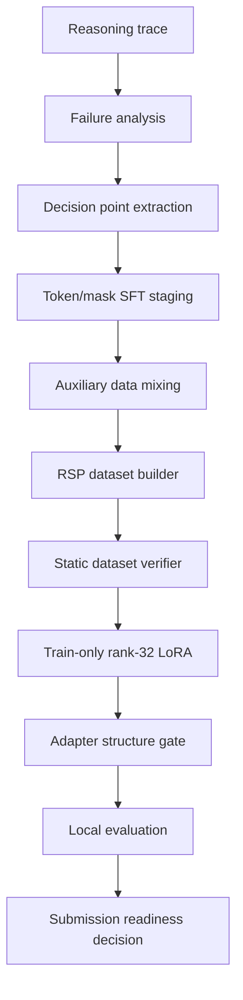

<p align="center">
  
</p>

# NVIDIA Nemotron Reasoning Adapter

### From reasoning failures to rule-selection training

NVIDIA Nemotron Reasoning Challenge를 계기로 시작한 reasoning adapter 연구·구현 프로젝트

단순한 SFT recipe 정리가 아닌, reasoning failure를 분석하고 규칙 선택 학습 문제로 재정의한 LoRA adapter training pipeline

## 프로젝트 요약

| 구분 | 내용 |
|---|---|
| 문제 정의 | reasoning failure를 정답 문자열 생성 실패가 아닌 rule-selection failure로 재정의 |
| 데이터 | token/mask completion-only SFT corpus, auxiliary replay, preference pairs |
| 학습 | rank-32 LoRA adapter, weighted SFT, SimPO-style preference learning |
| 검증 | dataset schema, token mask, adapter structure, evaluation safety gate |
| 공개 범위 | 핵심 코드, 작은 example dataset, 검증기, 학습 스크립트, 실험 기록 |
| 미포함 | 전체 원본 데이터, 최종 checkpoint, 검증되지 않은 최종 점수 주장 |

## 내가 한 작업

- reasoning failure 유형과 domain별 오답 패턴 분석
- prompt token과 assistant completion token을 분리한 token/mask SFT corpus 설계
- CoT-selected SFT, replay corpus, balanced mixing, auxiliary data interleaving 실험
- bit·equation 실패를 decision point와 branch trace로 분해
- `anchor_sft`, `decision_sft`, `decision_preferences`로 구성된 RSP schema 설계
- rank-32 LoRA adapter 변환과 SVD compression 경로 분석
- 동일 evaluation sample에서 여러 adapter를 비교하는 평가 workflow 구성
- training·evaluation·submission을 분리하는 safety gate와 static verifier 구현
- 팀 실험과 개인 구현의 경계를 구분한 공개용 패키지 정리

## 핵심 전환

초기 접근은 baseline 분석과 domain별 규칙 추가

일부 결과 개선과 동시에 규칙 증가에 따른 예외·충돌 확대

가장 큰 전환점은 reasoning failure를 직접적인 답 생성 문제가 아닌 **규칙 선택 문제**로 바라본 것

```text
Reasoning trace
      ↓
Decision point
      ↓
Candidate rules
      ↓
Correct branch selection
      ↓
Stable boxed answer
```

## 문제 구조

모델이 처리해야 하는 task는 긴 reasoning text 생성 자체가 목적이 아닌, hidden task에서 올바른 transformation rule을 선택하고 끝까지 유지하는 구조

주요 domain

| Domain | 문제 성격 |
|---|---|
| Bit manipulation | 8-bit binary input/output transformation rule 추론 |
| Gravity | `d = 0.5*g*t^2` 형태의 hidden gravitational constant 추론 |
| Unit conversion | 가상 단위계의 conversion rule 복원 |
| Text encryption | 예시 문장 쌍에서 substitution/encryption rule 복원 |
| Numeral conversion | 가상 numeral system 변환 규칙 추론 |
| Equation transformation | symbolic equation/string transformation rule 추론 |

주요 실패 패턴

- bit manipulation에서 output bit별 rule 선택 오류
- equation transformation에서 branch rule과 position-specific mapping 혼동
- reasoning 형식은 자연스럽지만 마지막 `\boxed{}` 답이 틀리는 문제
- adapter 변환 과정의 training-serving mismatch
- broad SFT로 weak domain은 개선되지만 protected domain이 손상되는 현상

## 데이터 설계

원본 문제를 그대로 학습 데이터로 넣는 대신, reasoning trace와 정답 출력에 필요한 정보만 학습 단위로 재구성

### Token/mask SFT

```text
tokens = prompt tokens + assistant reasoning + final answer
mask   = 0              + 1                  + 1
```

Trainer 입력 구조

```text
input_ids = tokens[:-1]
targets   = tokens[1:]
weights   = mask[1:]
```

prompt memorization을 줄이고 solver trace와 최종 `\boxed{answer}` 생성에 집중하는 completion-only loss 구조

### 내가 구성한 데이터 흐름

| 데이터·실험 | 구성 | 목적 |
|---|---|---|
| CoT-selected SFT | checker 통과 row만 선별 | noisy reasoning 제거 |
| token/mask replay SFT | deterministic trace와 logprob order 보존 | 동일 학습 입력 재현 |
| merged balanced SFT | replay corpus와 auxiliary row interleaving | weak domain 보강과 broad behavior 유지 |
| math replay | 외부 reasoning row를 일정 간격으로 삽입 | general reasoning coverage 확장 |
| equation branch-map | symbolic branch-map row 구성 | equation rule-selection failure 보강 |
| domain weighting | equation·bit domain sample/loss weight 조정 | weak domain update 강도 제어 |
| RSP dataset | 세 가지 row family로 재구성 | rule-selection 학습 문제로 전환 |

### RSP public package

| Row family | Rows | 목적 |
|---|---:|---|
| `anchor_sft` | 7,646 | broad behavior 보존 |
| `decision_sft` | 2,666 | bit·equation rule trace 학습 |
| `decision_preferences` | 2,500 | correct branch와 plausible wrong branch 비교 |

학습 단계

1. `anchor_sft`와 `decision_sft` 기반 weighted completion-only SFT
2. `decision_preferences` 기반 SimPO-style pairwise preference learning

세부 데이터 설계는 [docs/dataset-design.md](docs/dataset-design.md)에 정리

## NVIDIA 기술 활용

| 항목 | 사용 방식 |
|---|---|
| Nemotron | `NVIDIA-Nemotron-3-Nano-30B-A3B-BF16` base model을 adapter 학습 대상으로 사용 |
| LoRA | rank 32 / alpha 32 / dropout 0.0 adapter contract 중심 실험 |
| Nemotron-H / MoE structure | attention·projection·MLP target module 구성 분석 |
| GPU runtime | BF16 training, gradient checkpointing, memory optimization |
| Evaluation runtime | vLLM·Transformers-style boxed-answer extraction safety check |

## 시스템 구조



핵심 경계

- `rsp_train_tokenmask_compatible.py`: train-only entrypoint
- `verify_rsp_dataset.py`: row schema·boxed answer·count·domain constraint 확인
- `verify_rsp_train_shell.py`: train script safety·adapter structure 확인
- `eval/auto_evaluator.py`: adapter 생성 이후 local evidence 수집
- `SUBMISSION_ALLOWED = False`, `EVALUATION_ALLOWED = False`: 안전 경계 기본값

## 실험 흐름

| 영역 | 시도 | 정리 |
|---|---|---|
| LoRA SFT | rank 32 / alpha 32 adapter training | 기본 adapter training path |
| 4-bit probe | 제한된 GPU 환경 feasibility 확인 | 자원 조건 점검 |
| BF16 training | 고메모리 GPU training route | 선호 학습 경로 |
| Completion-only loss | prompt mask 0, completion mask 1 | token/mask SFT 핵심 |
| Auxiliary mixing | math replay, equation branch-map interleaving | 원본 corpus 압도 방지 |
| Domain weighting | equation·bit reweighting | domain별 update 강도 조절 |
| SVD compression | fused projection의 rank-32 adapter 변환 | lossy conversion risk 확인 |
| Multi-adapter evaluation | 동일 sample에서 adapter 비교 | evaluation workflow 구성 |
| RSP | rule-selection SFT + preference learning | 현재 공개 training package |

## 저장소 구성

| 경로 | 내용 |
|---|---|
| `build_rsp_dataset.py` | RSP 학습 데이터 구성 |
| `rsp_train_tokenmask_compatible.py` | token/mask 기반 학습 entrypoint |
| `verify_rsp_dataset.py` | dataset static verification |
| `verify_rsp_train_shell.py` | training shell과 adapter gate |
| `eval/` | local evaluator와 evaluation workflow |
| `docs/` | architecture, dataset, training, experiment, reproducibility 기록 |
| `team/minjaechoics/` | 팀 실험 맥락 보존용 artifact |
| `examples/` | schema 확인용 작은 example dataset |

## 실행

의존성 설치

```bash
python -m pip install -r requirements.txt
```

데이터 staging 및 RSP dataset 구성

```bash
DATASET_DIR=data/rsp_dataset

python build_rsp_dataset.py \
  --anchor /path/to/anchor.jsonl \
  --equation /path/to/equation.jsonl \
  --target-repair /path/to/target_repair_rows.jsonl \
  --output-dir "$DATASET_DIR"
```

정적 검증

```bash
python verify_rsp_dataset.py \
  --dataset-dir "$DATASET_DIR" \
  --json-output "$DATASET_DIR/rsp_verification.json"

python verify_rsp_train_shell.py \
  --train-script rsp_train_tokenmask_compatible.py \
  --dataset-verification "$DATASET_DIR/rsp_verification.json" \
  --json-output "$DATASET_DIR/rsp_train_shell_verification.json"
```

학습 dry-run

```bash
python rsp_train_tokenmask_compatible.py \
  --dataset-dir "$DATASET_DIR" \
  --model /path/to/NVIDIA-Nemotron-3-Nano-30B-A3B-BF16 \
  --dry-run
```

전체 학습에는 Nemotron model, CUDA/PyTorch runtime, 호환 GPU 메모리, private/full dataset artifact 필요

`examples/rsp_dataset_sample/`는 schema preview용 소형 데이터셋. 전체 row-count gate 통과용이 아닌 구조 확인용 예시

## 현재 상태

| 영역 | 상태 |
|---|---|
| 문서 | 한국어 중심의 공개용 정리 |
| Clean repo | 핵심 코드·문서·example 중심 구성 |
| Full dataset | 공개 저장소 제외, private artifact로 관리 |
| RSP package | train-ready, static verification 가능 |
| Final adapter | 공개 저장소 미포함 |
| Final verified score | 주장하지 않음 |

## 팀 실험 경계

팀원 Minjae의 weak-domain 보정 실험 파일을 `team/minjaechoics/`에 선별 보관

포함 내용

- `equation_numeric` symbolic branch-map failure 분석
- residual LoRA, patch LoRA, lambda·scale sweep, SVD rank-32 merge
- guarded replay, DPO/EWC, GRPO-style narrow tuning
- Ortho-LoRA task-wise gradient projection
- local metric-style evaluator와 equation-specific evaluator

팀 artifact는 실험 맥락 보존용 자료. 개인 단독 구현으로 주장하지 않음

## 배운 점

- reasoning adapter 성능은 단순 데이터 양보다 데이터 구조, mask, ordering, domain balance에 크게 좌우
- token/mask SFT의 핵심은 deterministic solver trace와 completion-only loss
- SVD adapter 변환은 practical하지만 lossy하며 training-serving mismatch 가능성 존재
- score 숫자만으로 재현 가능한 engineering claim 구성 불가
- 포트폴리오의 핵심은 최종 점수보다 실험 경계, 실패 기록, safety gate의 투명한 공개

## AI 보조 도구 사용

Claude와 Codex를 코드 분석, 실험 정리, 문서화 보조에 사용

최종 project framing, claim boundary, 공개 가능한 근거 선택은 로컬 파일과 검증 가능한 evidence 확인을 거쳐 정리

---

*Reasoning quality begins with choosing the right rule.*
