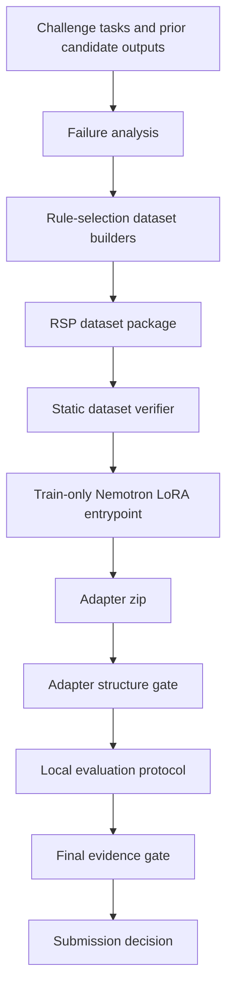

# Nemotron Reasoning Adapter Pipeline

| Summary | Status |
| --- | --- |
| What I built | A train-ready NVIDIA Nemotron rank-32 LoRA pipeline for rule-selection post-training. |
| Current evidence | RSP dataset and train-shell gates pass static verification with 0 errors. |
| Not claimed | No final RSP adapter, final leaderboard score, or winning-solution claim is included. |

## Overview

This repository contains a train-ready adapter learning pipeline for the NVIDIA Nemotron Model Reasoning Challenge. The project focuses on building a reproducible post-training package around `nvidia/NVIDIA-Nemotron-3-Nano-30B-A3B-BF16`, with static dataset checks, adapter-structure validation, and submission safety gates.

The current portfolio-ready claim is intentionally conservative: this is not presented as a final score-achieving solution. The main outcome is a reproducible training package for a rank-32 LoRA adapter, plus an analysis-driven method for turning reasoning failures into a rule-selection learning problem.

## Problem

The challenge requires a model to solve hidden reasoning tasks and return the final answer in `\boxed{}` format. The tasks include domains such as bit manipulation, numeric equations, ciphers, gravity, unit conversion, and numeral transformations.

The practical failure mode is not only whether the model can generate long reasoning text. It must select the correct latent rule, preserve that rule through the completion, and produce a stable boxed answer. Small mistakes in rule selection often lead to confident but wrong final answers.

## Key Idea

The project reframes the adapter objective from generic supervised fine-tuning into rule-selection post-training.

Core ideas:

- Convert reasoning failures into explicit rule-selection examples.
- Preserve broad-domain behavior with anchor SFT rows.
- Focus corrective learning on decision-heavy bit manipulation and equation tasks.
- Use pairwise chosen/rejected completions so the adapter learns which rule trace should be preferred.
- Keep evaluation and submission separated from training to avoid treating public submissions as validation.

The latest candidate path is called RSP, or Rule Selection Post-Training.

## NVIDIA Technology Usage

The project is built around NVIDIA's Nemotron model and the competition runtime constraints.

- Base model: `nvidia/NVIDIA-Nemotron-3-Nano-30B-A3B-BF16`
- Adapter method: LoRA/QLoRA-style rank-32 adapter training
- Target modules: `q_proj`, `k_proj`, `v_proj`, `o_proj`, `in_proj`, `out_proj`, `up_proj`, `down_proj`, `lm_head`
- Context length target: 8192 tokens
- Precision/runtime target: BF16 where available, 4-bit loading option for constrained training
- Evaluation path: local evaluator scripts using Transformers or vLLM-compatible inference patterns
- Hardware planning: Kaggle-style T4 probing and external NVIDIA GPU training wrapper for PRO 6000-class runs

## System Architecture



The important design boundary is that the training entrypoint is train-only. It is configured to produce an adapter package, but evaluation and submission are guarded by separate scripts and explicit evidence checks.

See [docs/architecture.md](docs/architecture.md) for the detailed component map.

## Dataset & Training Pipeline

For a clean public checkout, stage the full/private RSP dataset under a local dataset directory such as `data/rsp_dataset` or regenerate it from private source inputs. Full generated datasets are intentionally excluded from Git.

| Row family | Rows | Purpose |
| --- | ---: | --- |
| `anchor_sft` | 7,646 | Preserve broad behavior across supported domains |
| `decision_sft` | 2,666 | Teach explicit rule traces for target failure domains |
| `decision_preferences` | 2,500 | Contrast correct and incorrect rule-selection completions |

The verified domain split includes anchor rows for bit manipulation, equations, ciphers, gravity, unit conversion, and numeral tasks. Decision and preference rows currently focus on bit manipulation and numeric equation tasks.

Training is implemented as two phases:

1. Weighted completion-only SFT over anchor and decision rows.
2. Pairwise rule-selection preference learning over chosen/rejected completions.

See [docs/training-methodology.md](docs/training-methodology.md) for details.

## Evaluation & Submission Safety

The repository separates training, evaluation, and submission.

- `verify_rsp_dataset.py` validates dataset structure, boxed answers, row counts, and selected domain-specific constraints.
- `verify_rsp_train_shell.py` statically checks the RSP training script and can validate a produced adapter zip.
- `verify_rsp_train_shell.py --adapter-zip ...` validates adapter configuration and LoRA tensor structure after training.
- The RSP train entrypoint keeps `SUBMISSION_ALLOWED = False` and `EVALUATION_ALLOWED = False`.
- Local evaluation scripts are treated as evidence collection, not as automatic submission approval.

This means a generated `submission.zip` is only an adapter artifact. It is not treated as proof of leaderboard performance.

## Current Status

| Area | Status |
| --- | --- |
| RSP dataset package | Verified locally with 0 static errors |
| RSP train package | Train-ready entrypoint and PRO 6000 wrapper exist |
| Latest RSP adapter | Not yet finalized in this folder |
| Latest verified score | Not available |
| Public release state | Documentation added; cleanup still required before publishing |

Historical notes are kept transparent:

- Historical control/adapter results exist in internal project notes, but they are not presented as final reproducible RSP results.
- MG2 and MG3 experiments are treated as rejected or superseded candidate directions.
- The current public claim should remain: train-ready, reproducible package with safety gates.

## Repository Structure

The current working folder is a research workspace, not yet a minimal public repository. The recommended public structure is:

```text
.
├── README.md
├── docs/
│   ├── architecture.md
│   ├── training-methodology.md
│   ├── experiments.md
│   ├── reproducibility.md
│   └── project-status.md
├── build_rsp_dataset.py
├── rsp_train_huikang_compatible.py
├── rsp_run_train_pro6000.sh
├── verify_rsp_dataset.py
├── verify_rsp_train_shell.py
├── competition_model_evidence.json
├── rsp_design.md
├── eval/
│   └── auto_evaluator.py
└── examples/
    └── rsp_dataset_sample/
```

Before publishing, large local datasets, model caches, checkpoints, external notebooks, and generated outputs should be removed or moved to release artifacts. See [docs/project-status.md](docs/project-status.md).

## How to Run

Install the Python dependencies:

```bash
python -m pip install -r requirements.txt
```

Stage the dataset. In a clean public repo, point `DATASET_DIR` to the private/full dataset location or regenerate it from source inputs.

```bash
DATASET_DIR=data/rsp_dataset

python build_rsp_dataset.py \
  --anchor /path/to/anchor.jsonl \
  --equation /path/to/equation.jsonl \
  --target-repair /path/to/target_repair_rows.jsonl \
  --output-dir "$DATASET_DIR"
```

If the dataset has already been staged, run the static checks. These do not require GPU training:

```bash
python verify_rsp_dataset.py \
  --dataset-dir "$DATASET_DIR" \
  --json-output "$DATASET_DIR/rsp_verification.json"

python verify_rsp_train_shell.py \
  --train-script rsp_train_huikang_compatible.py \
  --dataset-verification "$DATASET_DIR/rsp_verification.json" \
  --json-output "$DATASET_DIR/rsp_train_shell_verification.json"
```

Dry-run the training entrypoint after the base model and tokenizer are available:

```bash
python rsp_train_huikang_compatible.py \
  --dataset-dir "$DATASET_DIR" \
  --model /path/to/NVIDIA-Nemotron-3-Nano-30B-A3B-BF16 \
  --dry-run
```

Build the external GPU payload:

```bash
python build_rsp_vast_payload.py \
  --dataset-dir "$DATASET_DIR" \
  --output-dir outputs/rsp_vast_payload/payload \
  --archive outputs/rsp_vast_payload/rsp_pro6000_payload.tar.gz
```

Run GPU training after unpacking or staging the payload at the wrapper's expected workspace path in a compatible external GPU environment:

```bash
bash /workspace/rsp_vast/payload/rsp_run_train_pro6000.sh
```

After training, validate the adapter zip:

```bash
python verify_rsp_train_shell.py \
  --train-script rsp_train_huikang_compatible.py \
  --dataset-verification "$DATASET_DIR/rsp_verification.json" \
  --adapter-zip /path/to/submission.zip \
  --json-output /path/to/rsp_post_training_adapter_gate.json
```

Full training requires the Nemotron model, compatible CUDA/PyTorch dependencies, enough GPU memory, and the challenge data/evaluation setup.

## My Contributions

- Reframed the task as rule-selection learning rather than generic answer imitation (`rsp_design.md`, `docs/training-methodology.md`).
- Built the RSP dataset design with anchor SFT, decision SFT, and decision preference rows (`build_rsp_dataset.py`).
- Implemented static verifiers for dataset integrity, train-shell constraints, and adapter structure (`verify_rsp_dataset.py`, `verify_rsp_train_shell.py`).
- Implemented a train-only Nemotron LoRA entrypoint with completion-only SFT and pairwise preference learning (`rsp_train_huikang_compatible.py`).
- Built external runtime packaging for PRO 6000-class training (`build_rsp_vast_payload.py`, `rsp_run_train_pro6000.sh`).
- Designed safety gates to keep training, evaluation, and submission as separate stages (`execution_lock.py`, `promote_final_evidence.py`).
- Audited prior experiment paths and documented which claims are supported by local evidence (`docs/experiments.md`, `docs/project-status.md`).

## Lessons Learned

- Reasoning adapter work benefits from treating failure modes as data design problems.
- A high public score is not enough unless the recipe, adapter, and evaluation evidence are reproducible.
- Submission should not be used as the validation loop.
- Static gates are useful for preventing accidental leakage between training, evaluation, and submission workflows.
- Portfolio documentation should distinguish train readiness from verified model performance.

## AI Assistance

Claude and Codex were used as coding and documentation assistants during project exploration, implementation review, and final repository organization. The project framing, implementation choices, evidence selection, and public claims were curated by the project author.

AI-generated suggestions were treated as drafts and checked against local files, verification scripts, and available project evidence before being included in this README.
