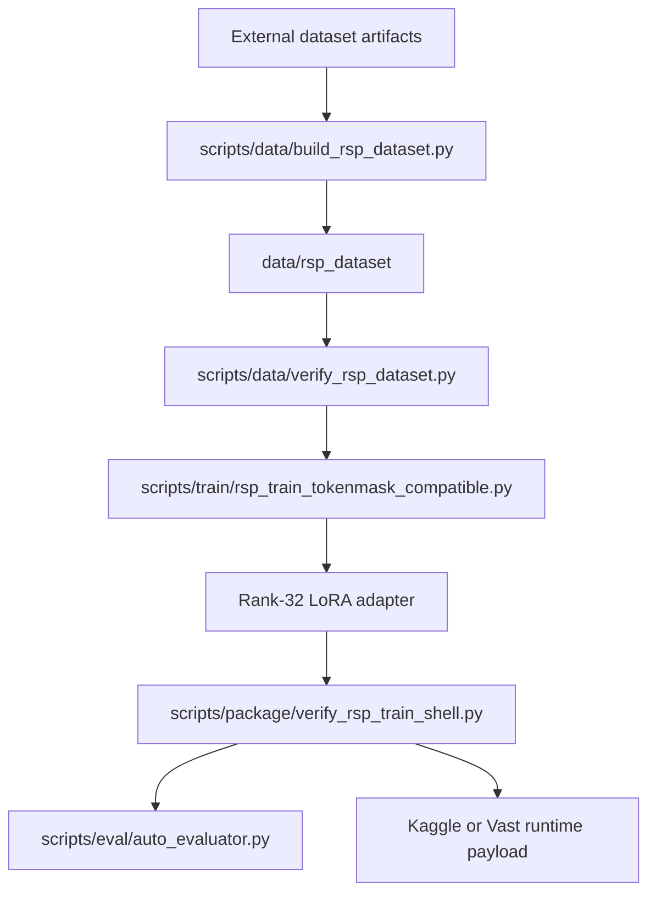
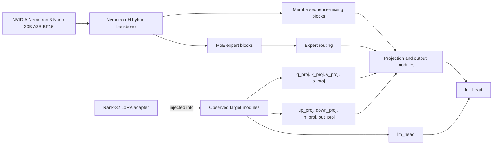

# Architecture

이 문서는 공개 저장소의 시스템 구조를 빠르게 확인하기 위한 overview입니다.

## Project Pipeline

## Nemotron Structure

아래 그림은 이 프로젝트에서 학습·분석한 target surface를 중심으로 단순화한 개념도입니다. Nemotron의 실제 layer-by-layer 구현 전체를 대체하는 공식 model graph가 아니며, 공개 notebook과 학습 코드에서 확인된 Mamba/MoE backbone 및 adapter injection 지점을 표현합니다.

Base model: [NVIDIA Nemotron 3 Nano 30B A3B BF16 on Hugging Face](https://huggingface.co/nvidia/NVIDIA-Nemotron-3-Nano-30B-A3B-BF16)

### Adapter Injection Surface

| Surface | Role in this project |
| --- | --- |
| Attention projections | `q_proj`, `k_proj`, `v_proj`, `o_proj` target set |
| MLP and related projections | `up_proj`, `down_proj`, `in_proj`, `out_proj` target set |
| Output head | `lm_head` manual supplement and namespace validation |
| MoE experts | expert LoRA weight tying and target-name compatibility checks |

## Components

| Component | Location | Role |
| --- | --- | --- |
| Dataset builder | `scripts/data/` | token/mask 및 RSP row 생성 |
| Dataset contract | `schemas/` | row schema와 rejection 조건 정의 |
| Training entrypoint | `scripts/train/` | Nemotron LoRA 학습 및 adapter 저장 |
| Evaluation | `scripts/eval/` | boxed answer extraction과 local scoring |
| Packaging and gates | `scripts/package/` | Kaggle/Vast bundle과 static validation |
| Experiment records | `experiments/`, `techniques/` | 실제 시도와 방법별 분석 보존 |

자세한 데이터 구조는 [`dataset.md`](dataset.md), 학습 흐름은 [`training-methodology.md`](training-methodology.md), 실행 조건은 [`reproducibility.md`](reproducibility.md)를 참고합니다.
