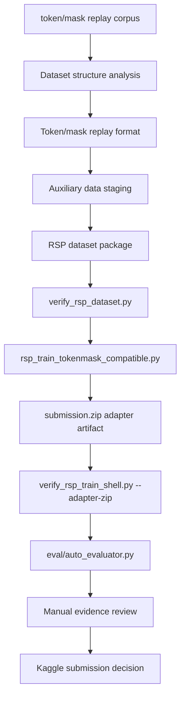

# Architecture

이 문서는 public clean repo의 구조를 설명합니다. 전체 연구 폴더에는 많은 notebook, dataset, checkpoint, cache가 있었지만, 이 repo는 GitHub 공개용으로 핵심 training package와 문서만 남긴 형태입니다.

## 목적

목표는 단순한 Kaggle notebook 묶음이 아니라, NVIDIA Nemotron reasoning adapter 학습을 다음 단계로 분리한 reproducible package로 정리하는 것입니다.

1. source data / prior experiment analysis
2. dataset staging
3. static dataset verification
4. train-only adapter builder
5. adapter structure gate
6. local evaluation
7. submission readiness decision

공식 competition evaluator는 `submission.zip` 안의 LoRA adapter를 Nemotron-3-Nano-30B base model에 로드하고, vLLM inference로 hidden reasoning puzzles를 풉니다. 따라서 architecture의 핵심은 “답안을 CSV로 만드는 코드”가 아니라 **rank-32 adapter artifact를 안전하게 만들고 검증하는 pipeline**입니다.

## High-Level Flow



## Component Map

| Component | Files | Responsibility |
| --- | --- | --- |
| Documentation | `README.md`, `docs/*.md` | 한국어 중심 project overview, dataset/experiment/methodology 설명 |
| Dataset design | `docs/dataset-design.md`, `rsp_schema.json`, `rsp_design.md` | Token/mask data 구조와 RSP row schema 설명 |
| Dataset builder | `build_rsp_dataset.py` | anchor/decision/preference rows를 RSP package로 생성 |
| Dataset verifier | `verify_rsp_dataset.py` | row schema, boxed answer, count, selected domain constraints 검증 |
| Train entrypoint | `rsp_train_tokenmask_compatible.py` | rank-32 Nemotron LoRA adapter train-only script |
| Runtime bundle | `build_rsp_runtime_bundle.py`, `build_rsp_train_kernel.py`, `build_rsp_vast_payload.py` | Kaggle/external GPU 실행 payload 구성 |
| GPU wrapper | `rsp_run_train_pro6000.sh` | PRO 6000-class runtime에서 training 실행 |
| Adapter gate | `verify_rsp_train_shell.py` | train script safety와 adapter zip structure 검증 |
| Evaluation | `eval/auto_evaluator.py`, `eval/run_eval.sh` | adapter 생성 이후 local evidence 수집 |
| Examples | `examples/rsp_dataset_sample/` | public-safe 작은 sample dataset |
| Team artifacts | `team/minjaechoics/` | teammate weak-domain analysis, residual/patch LoRA, Ortho-LoRA, local evaluator experiments |

## Public Architecture Boundary

이 repo는 연구 전체를 그대로 공개하지 않습니다.

포함하는 것:

- 핵심 Python scripts
- RSP schema and sample dataset
- verification tools
- train-only script
- selected teammate experiment artifacts
- public documentation

제외하는 것:

- full generated datasets
- full token/mask replay corpus copy
- checkpoints
- `submission.zip`
- `.safetensors`, `.bin`, `.pt`, `.pth`
- Kaggle/Hugging Face cache
- third-party notebook dumps
- private notebook outputs

`team/minjaechoics/`는 historical/team experiment artifact입니다. Root-level RSP scripts가 current public training package이며, team folder의 scripts는 weak-domain analysis와 follow-up methods를 설명하는 reference로 둡니다.

## RSP Candidate Path

RSP는 Rule Selection Post-Training의 약자입니다.

```text
failure analysis
-> decision point extraction
-> anchor_sft / decision_sft / decision_preferences
-> weighted completion-only SFT
-> pairwise rule-selection preference learning
-> adapter structure gate
```

RSP는 earlier experiment를 모두 대체하는 final adapter가 아닙니다. 오히려 earlier experiment에서 얻은 교훈을 public-safe training package로 정리한 것입니다.

## Training and Submission Separation

`rsp_train_tokenmask_compatible.py`는 다음 값을 유지합니다.

```python
SUBMISSION_ALLOWED = False
EVALUATION_ALLOWED = False
```

이 decision은 의도적입니다.

- training script는 adapter를 만들 수 있습니다.
- training script는 evaluation/submission을 자동으로 실행하지 않습니다.
- adapter는 별도 structure gate를 통과해야 합니다.
- local eval evidence 없이는 final readiness를 주장하지 않습니다.

Competition 제출 조건과 local gate의 대응 관계는 다음과 같습니다.

| Competition requirement | Local gate |
| --- | --- |
| rank <= 32 LoRA adapter | `verify_rsp_train_shell.py --adapter-zip` |
| `adapter_config.json` 포함 | adapter zip structure check |
| boxed final answer 생성 | dataset completion normalization, local eval protocol |
| vLLM inference compatibility | target module/key/shape validation |
| hidden test accuracy | local eval evidence를 별도로 수집하되 README claim으로 과장하지 않음 |

## Data Flow

```text
private/full source inputs
  -> build_rsp_dataset.py
  -> data/rsp_dataset/
       rsp_anchor_sft.jsonl
       rsp_decision_sft.jsonl
       rsp_decision_preferences.jsonl
       rsp_manifest.json
  -> verify_rsp_dataset.py
  -> rsp_train_tokenmask_compatible.py
  -> adapter artifact
  -> verify_rsp_train_shell.py --adapter-zip
  -> local evaluation
```

Public repo에는 full `data/rsp_dataset`을 포함하지 않습니다. 대신 `examples/rsp_dataset_sample`로 schema와 format만 보여줍니다.

## Design Principles

- 점수보다 reproducibility와 claim boundary를 우선합니다.
- dataset format과 masking을 명시적으로 검증합니다.
- training, evaluation, submission을 분리합니다.
- adapter 구조가 틀리면 GPU/eval 전에 실패하도록 합니다.
- 외부 원천 corpus와 내 재구성/혼합/검증 작업의 경계를 문서화합니다.
