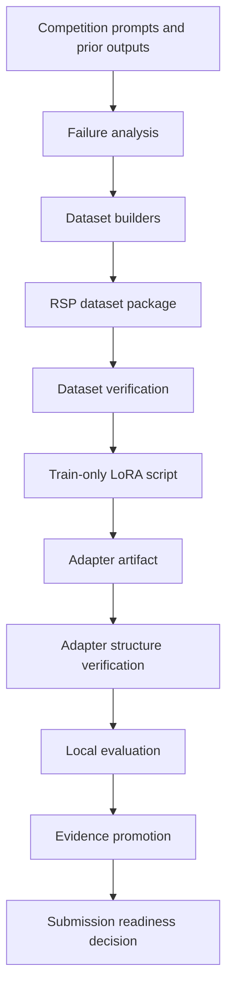

# Architecture

## Purpose

This project is organized around a narrow objective: create a reproducible adapter-training package for NVIDIA Nemotron reasoning tasks, with explicit gates around dataset validity, adapter structure, evaluation, and submission.

The architecture is deliberately more conservative than a typical experiment notebook. It separates the research workspace from the trainable package and keeps unsupported score claims out of the release path.

## High-Level Flow



## Main Components

| Component | Representative files | Responsibility |
| --- | --- | --- |
| Evidence and contracts | `competition_model_evidence.json`, `CURRENT_GOAL_STATUS.md`, `rsp_design.md`, `data_design.md` | Record model constraints, candidate status, dataset strategy, and known limitations |
| Dataset builders | `build_rsp_dataset.py`, historical MG2/MG3 builders | Convert traces and failure cases into trainable rows |
| Dataset verifier | `verify_rsp_dataset.py` | Check row schemas, boxed answers, counts, duplicates, and selected domain constraints |
| Training entrypoint | `rsp_train_huikang_compatible.py` | Train a rank-32 LoRA adapter from RSP rows without evaluating or submitting |
| Training wrapper | `rsp_run_train_pro6000.sh` | Prepare a GPU environment, download required assets, run training, and validate the output artifact |
| Adapter gates | `verify_rsp_train_shell.py --adapter-zip ...` | Check LoRA rank, target modules, safetensors layout, and training-script safety constraints |
| Evaluation scripts | `eval/auto_evaluator.py`, `eval/run_eval.sh` | Run local evidence collection after an adapter exists |
| Promotion gates | `promote_final_evidence.py`, `execution_lock.py`, related verification scripts | Prevent treating incomplete evidence as final submission approval |

## RSP Candidate Path

RSP stands for Rule Selection Post-Training. It is the current candidate path and should be the main story for the public portfolio repository.

RSP uses three row families:

- `anchor_sft`: broad-domain examples used to preserve existing behavior.
- `decision_sft`: rule-trace examples for domains where wrong latent rule selection caused failures.
- `decision_preferences`: chosen/rejected completions for pairwise rule-selection preference learning.

The current RSP package is verified as a dataset and train shell. It is not yet a final scored adapter.

## Boundary Between Training and Submission

The training entrypoint intentionally sets:

```python
SUBMISSION_ALLOWED = False
EVALUATION_ALLOWED = False
```

This is an architectural decision. The train step may write an adapter zip, but it cannot claim that the artifact is leaderboard-ready. Evaluation and final evidence promotion are separate stages.

## Public Repository Shape

The current folder contains a large working archive. A public GitHub version should expose the reproducible path and remove local bulk artifacts.

Recommended public layout:

```text
.
├── README.md
├── docs/
├── build_rsp_dataset.py
├── rsp_train_huikang_compatible.py
├── rsp_run_train_pro6000.sh
├── verify_rsp_dataset.py
├── verify_rsp_train_shell.py
├── competition_model_evidence.json
├── rsp_design.md
├── eval/
└── examples/
```

Large generated outputs, model caches, checkpoints, dependency caches, third-party notebook dumps, and ad hoc scratch folders should not be committed.

## Design Principles

- Prefer reproducible package evidence over leaderboard storytelling.
- Keep training, evaluation, and submission as separate workflow stages.
- Make hidden assumptions explicit in JSON contracts or verification scripts.
- Use static gates before consuming GPU time.
- Treat historical experiments as context, not as current claims.
