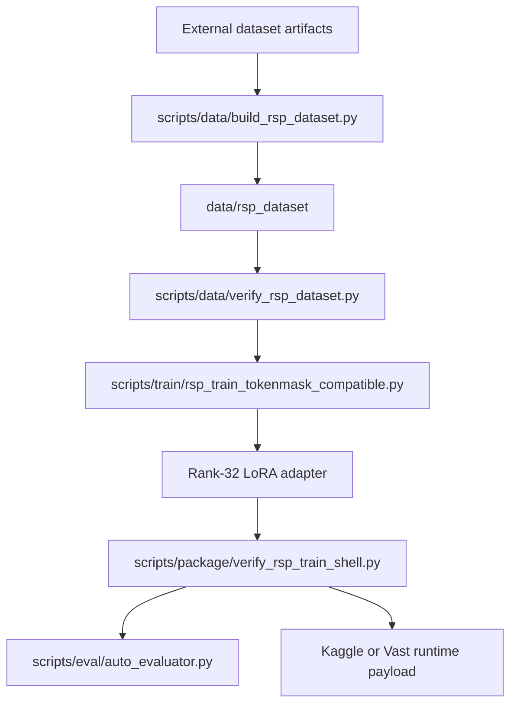
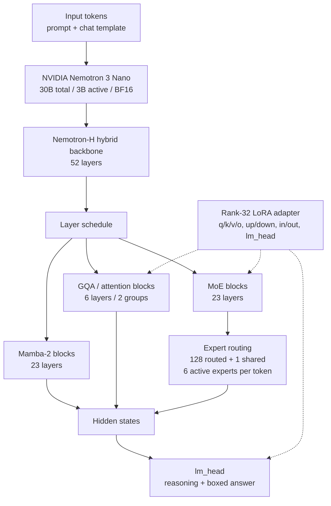

# Architecture

이 문서는 공개 저장소의 시스템 구조를 빠르게 확인하기 위한 overview입니다.

## Project Pipeline

## Nemotron Model Structure Visualization

아래 그림은 이 프로젝트의 Nemotron 모델 구조를 설명하기 위한 시각화 자료입니다. 학습·분석한 adapter target surface를 중심으로 단순화한 개념도이며, Nemotron의 실제 layer-by-layer 구현 전체를 대체하는 공식 model graph는 아닙니다. 공개 notebook과 학습 코드에서 확인된 Mamba/MoE backbone 및 adapter injection 지점을 표현합니다.

Base model: [NVIDIA Nemotron 3 Nano 30B A3B BF16 on Hugging Face](https://huggingface.co/nvidia/NVIDIA-Nemotron-3-Nano-30B-A3B-BF16)

구조적으로는 sequence mixing을 담당하는 Mamba 계열 block과 sparse expert routing을 사용하는 MoE block이 hybrid backbone을 구성하고, 이 프로젝트에서는 attention/projection/MLP 계열 module과 `lm_head`를 LoRA injection 및 namespace 검증 대상으로 다뤘습니다. 아래 도식은 이 학습 경로와 adapter 적용 지점을 한눈에 보기 위한 것입니다.

이 시각화는 모델 card에서 확인되는 52-layer 구성(23 Mamba-2 layers, 6 GQA/attention layers, 23 MoE layers)과 MoE의 expert routing(128 routed experts + 1 shared expert, token당 6개 활성)을 요약합니다. LoRA 경로는 이 프로젝트의 rank-32 adapter 및 `lm_head` 보완 경로를 나타냅니다. 상세 수치와 사용 조건은 [Hugging Face model card](https://huggingface.co/nvidia/NVIDIA-Nemotron-3-Nano-30B-A3B-BF16)에서 확인할 수 있습니다.

### Adapter Injection Surface

| Surface | Role in this project |
| --- | --- |
| Attention projections | `q_proj`, `k_proj`, `v_proj`, `o_proj` target set |
| MLP and related projections | `up_proj`, `down_proj`, `in_proj`, `out_proj` target set |
| Output head | `lm_head` manual supplement and namespace validation |
| MoE experts | expert LoRA weight tying and target-name compatibility checks |

## Components

| Component | Location | Role |
| --- | --- | --- |
| Dataset builder | `scripts/data/` | token/mask 및 RSP row 생성 |
| Dataset contract | `schemas/` | row schema와 rejection 조건 정의 |
| Training entrypoint | `scripts/train/` | Nemotron LoRA 학습 및 adapter 저장 |
| Evaluation | `scripts/eval/` | boxed answer extraction과 local scoring |
| Packaging and gates | `scripts/package/` | Kaggle/Vast bundle과 static validation |
| Experiment records | `experiments/`, `techniques/` | 실제 시도와 방법별 분석 보존 |

자세한 데이터 구조는 [`dataset.md`](dataset.md), 학습 흐름은 [`training-methodology.md`](training-methodology.md), 실행 조건은 [`reproducibility.md`](reproducibility.md)를 참고합니다.
